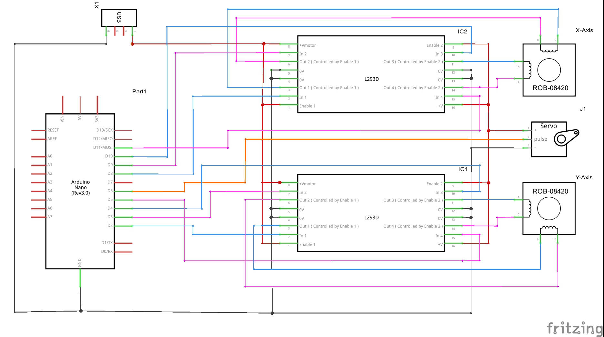
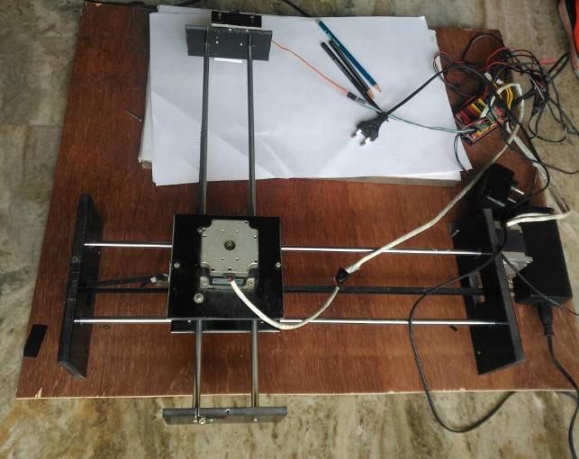
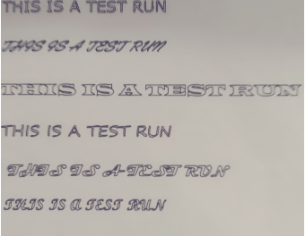
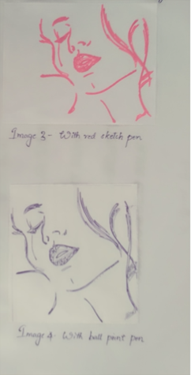
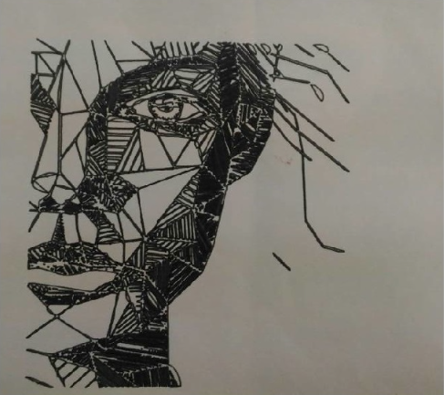

# CNC Plotter using ATMEGA328

This is a multi-purpose CNC-plotter that made using Arduino nano(at mega 328) as the main controller. Using ***Ink space***, we can create the gcodes of any image and using a ***Processing*** application called  ***gcode executer***, we can feed the g-code values to CNC-plotter.

## Circuit Diagram

## Fabricated Model

## Sample Output

We can use this CNC plotter for any purpose by changing the plotting head accordinglt. Here in this demonstration, we are using a pen/marker as the head.

* ***Text written in different fonts*** 

* ***Draw image with different colours*** 

  

* ***Draw with marker***

